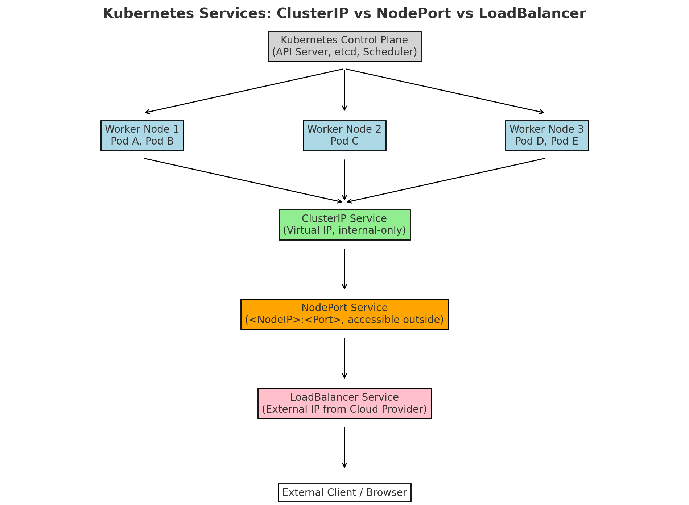

# 📘 Kubernetes Services: ClusterIP, NodePort, and LoadBalancer

## 🔹 Overview
Kubernetes Services provide stable network access to Pods. Since Pods can die, restart, or move across nodes, Services ensure reliable communication inside and outside the cluster.

---

## 🔹 Types of Services

### 1. ClusterIP (default)
- Exposes the Service **internally** within the cluster.
- Provides a **virtual IP** accessible only inside the cluster.
- Used for communication between microservices.

**YAML Example:**
```yaml
apiVersion: v1
kind: Service
metadata:
  name: my-clusterip-service
spec:
  type: ClusterIP
  selector:
    app: my-app
  ports:
  - port: 80
    targetPort: 8080
```

---

### 2. NodePort
- Exposes the Service on each Node’s IP at a static port (range: 30000–32767).
- Accessible externally as `<NodeIP>:<NodePort>`.
- Useful for development or direct access without a load balancer.

**YAML Example:**
```yaml
apiVersion: v1
kind: Service
metadata:
  name: my-nodeport-service
spec:
  type: NodePort
  selector:
    app: my-app
  ports:
  - port: 80
    targetPort: 8080
    nodePort: 30007
```

---

### 3. LoadBalancer
- Provisioned by cloud providers (AWS, GCP, Azure, etc.).
- Creates an **external IP** to distribute traffic across nodes.
- Best option for production external access.

**YAML Example:**
```yaml
apiVersion: v1
kind: Service
metadata:
  name: my-loadbalancer-service
spec:
  type: LoadBalancer
  selector:
    app: my-app
  ports:
  - port: 80
    targetPort: 8080
```

---

## 🔹 Architecture Diagram

Below is a conceptual diagram of how Services work in Kubernetes:

1. **ClusterIP** → Internal-only access for Pods.
2. **NodePort** → Exposes service on `<NodeIP>:<Port>` for external traffic.
3. **LoadBalancer** → Cloud provider external IP balances across nodes.



---

👉 **In short**:  
- **ClusterIP** = internal communication.  
- **NodePort** = expose via `<NodeIP>:<Port>`.  
- **LoadBalancer** = cloud-managed external access.  
