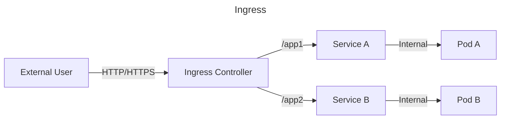
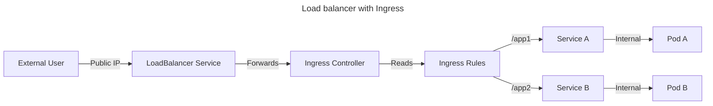

## 🌐 Simple words

🔷 	**Ingress →** In a microservices setup, Ingress is like the **traffic signboard** that decides which **service/application** should handle the request (e.g., /orders → Orders service, /users → Users service).

🔷 	**LoadBalancer →** Once a request reaches the chosen service, the load balancer is like a traffic cop that spreads the requests across **multiple replicas (pods**) of that service so none of them get overloaded.

## 🌐Example simple words
*	**Ingress →** Decides **which microservice** should get the request. 
     &nbsp;&nbsp;&nbsp;&nbsp;**Example:** /orders → Orders service, /users → Users service.
*	**LoadBalancer →** Distributes traffic across **multiple replicas of the same microservice** so no single pod is overloaded. 
     &nbsp;&nbsp;&nbsp;&nbsp;**Example:** Request to Orders service → spread across 5 Orders pods.

## 🌐Quick analogy
*	**Ingress =** A receptionist who checks the visitor’s purpose and directs them to the right department (service).
*	**LoadBalancer =** Inside each department, a manager assigns visitors evenly to available staff (replicas).

## 🛠 Technical explanation
🔷 	**Ingress →**

🔹	Works at the application routing layer (Layer 7). 
🔹	Provides path-based (/api/v1/users) or host-based (shop.example.com) routing to different microservices inside the cluster. 
🔹	Typically uses reverse proxies (NGINX, Traefik, HAProxy).

🔷 	**LoadBalancer →**

🔹	Works at the network layer (Layer 4/7). 
🔹	Ensures traffic is distributed evenly across replicas (pods) of the same service. 
🔹	In Kubernetes, a Service (ClusterIP/NodePort/LoadBalancer) inherently balances load between all its backing pods.

Ingress = routes to the right microservice.
LoadBalancer = balances traffic between the replicas of that microservice.

👉 **In short:** 
•	**Ingress =** routes to the right service **(routes to the right microservice)**. 
•	**LoadBalancer =** balances inside that service **(balances traffic between the replicas of that microservice)**.