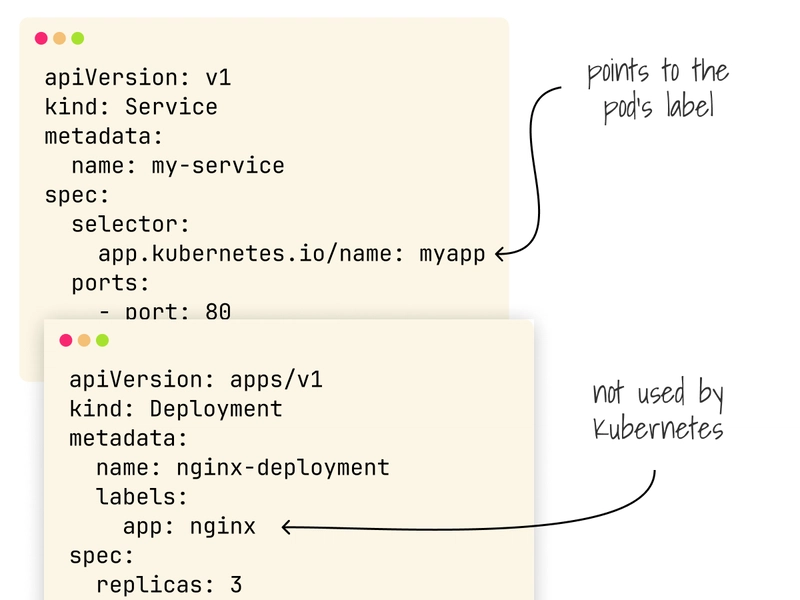
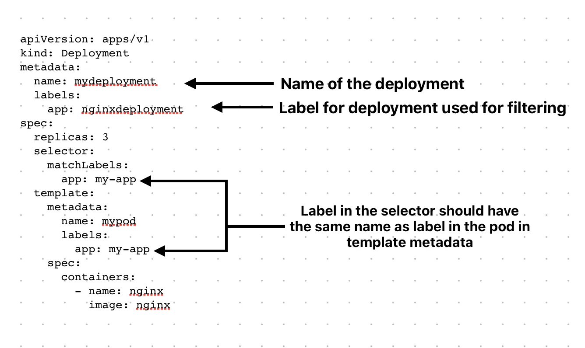

## 1) Namespace

A namespace in Kubernetes (k8s) is like a folder that helps organize and separate different groups of resources (like pods, services, deployments) inside the same cluster.

**Think of it like:**

*	Your computer has one big hard drive (the cluster).
*	You create different folders (the namespaces) to keep files for different projects separate, even though they’re all on the same hard drive.

[Click to learn](https://kubernetes.io/docs/concepts/overview/working-with-objects/namespaces/)

-----

## 2) POD and POD lifecycle

<details open>

<summary>What is POD ?</summary>

**Simple words:**

A Pod is like a small box that holds one or more containers.

- The containers in the box share the same address and storage.
- Kubernetes starts, stops, and moves the whole box as one thing.

**Technical explanation:**

A Pod is Kubernetes’ smallest deployable unit: one or more containers that run together on the same node, sharing the IP/ports, localhost network, and optional volumes. They’re scheduled, scaled, and restarted as a single unit.

</details>

<details>

<summary>Lifecycle of pod</summary>

[Click here to learn about Lifecycle](PDF/LifeCycle_of_POD.pdf)


> [!NOTE]
>
> CrashLoopBackOff is the one important lifecycle of POD
>
> [Click here to learn about CrashLoopBackOff](readMe/CrashLoopBackOff-README-section.md)

</details>

[Click for Example POD yml](Doc/resources/Create_pod.yml)

------
## 3) Request & Limit

**Request →** the minimum amount of CPU/Memory a Pod needs to run. Kubernetes will guarantee at least this much.

**Limit →** the maximum amount of CPU/Memory a Pod can use. Kubernetes won’t let it go beyond this.

<details>

<summary>Example of pod yml</summary>

```yaml
apiVersion: v1
kind: Pod
metadata:
  name: mypod
spec:
  containers:
    - name: mycontainer
      image: nginx
      resources:
        requests:
          cpu: "250m"     # minimum 0.25 CPU
          memory: "256Mi" # minimum 256 MB
        limits:
          cpu: "500m"     # maximum 0.5 CPU
          memory: "512Mi" # maximum 512 MB
```
</details>

### 3.1) LimitRange and ResourceQuota
[Read more about yaml](Doc/readMe/K8s-Resource-Management-Full-README.md)

**How it works with LimitRange:**
*	**LimitRange →** sets defaults per Pod/container.
*	**ResourceQuota →** sets the overall ceiling for the Namespace.

**Think of it like:**
*	**LimitRange =** rules for each employee (Pod).
*	**ResourceQuota =** total company budget (Namespace).

------
## 4) ReplicaSet

A Replica in Kubernetes means how many copies of your Pod you want running at the same time.

**Example:**

*	If you set replicas = 3, Kubernetes makes sure 3 identical Pods are always running.
*	If one Pod crashes, Kubernetes will automatically start a new one so that the count always stays at 3.

<details>

<summary>Replicaset command and more</summary>

**Get replicaset:**
```shell
kubectl get rs
```

```shell
kubectl describe rs/<replicaSet_name>
```

**Delete replicaset:**
```shell
kubectl get rs <replicaSet_name>
```

> [!NOTE]
>
> **Deleting a ReplicaSet also deletes all its Pods associated with that.**
>
> [Click here to learn](https://kubernetes.io/docs/concepts/workloads/controllers/replicaset/)

</details>

------
## 5) DemonSet
A DaemonSet ensures that all (or some) Nodes run a copy of a Pod(example Splunk Agent in each Node)

[Click to know more about DemonSet](Doc/readMe/DaemonSet-README.md)

------
## 6) Deployment


## 7) Labels and selectors

**Simple words:**

Some labels are **essential** because Kubernetes needs them to work (like the labels used by a **Service’s selector or operators**). Other labels are just **helpful for organization**, like tagging a Deployment so you can easily find or group it later.

**Technical explanation:**

Some labels are vital(**essential**) (e.g. service's selector, operators, etc.), and others are useful to **tag resources** (e.g. labelling a deployment).

<details>

<summary>Expand to learn more</summary>

[Click here to learn **some**](Doc/readMe/Label&Selector1.md)

[Click here to learn **more**](Doc/readMe/Label&Selector2.md)

## 🖼️ Tagging Resources



## 🖼️ Deployment and Service Example

<table>
  <tr>
    <td>
      <b>Example 1</b><br>
      
    </td>
    <td>
      <b>Example 2</b><br>
      
    </td>
  </tr>

<tr>
    <td>
      <b>Example 3</b><br>
      
    </td>
    <td>
      <b>Example 4</b><br>
      
    </td>
  </tr>
</table>

## 📺 Video Reference
[](https://www.youtube.com/watch?v=0CV__VnbYCc)

</details>

-----
## 7) Services

### 7.1) NodePort

By default, Kubernetes NodePort uses ports in the range 30000–32767.

### 7.1) ClusterIp

### 7.2) Ingress


------
## K8 commands
[Cheat sheet](https://spacelift.io/blog/kubernetes-cheat-sheet)

[Click to know more about Commands](Doc/readMe/General.md)